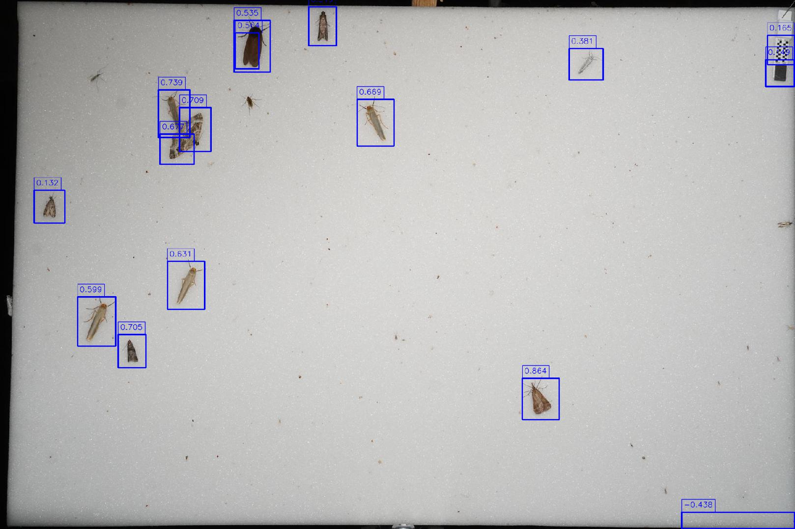

# C++ Version of the Blob Detector

## Installation

### Using Anaconda / Miniconda
```bash
conda create -n blob_detector -y python~=3.9.0 opencv~=4.5
conda activate blob_detector
```

### Compilation and installation
```bash
mkdir build
cd build
cmake -DCMAKE_INSTALL_PREFIX=${CONDA_PREFIX} ..
make -j && make install
```


## Examples

Example images can be found in the [`examples/images`](examples/images) folder.

### Visualize the detections
```bash
cd examples/visualization
mkdir build && cd build
cmake ..
make -j4

LD_LIBRARY_PATH=${CONDA_PREFIX}/lib ./detect ../../images/2021-08-02_Weinschale_4846.JPG
```

Output:


### Output detections in JSON format

```bash
cd examples/json_output
mkdir build && cd build
cmake ..
make -j4

LD_LIBRARY_PATH=${CONDA_PREFIX}/lib ./detect ../../images/2021-08-02_Weinschale_4846.JPG
```

Output:
```json
{"detections":[{"height":0.09812500700354576,"score":0.5351619082347334,"width":0.04500000551342964,"x":0.2946875002235174,"y":0.0384374987334013},{"height":0.06795792692423919,"score":0.56436662986565,"width":0.029375001788139343,"x":0.29625000059604645,"y":0.06241646125488498},{"height":0.09343751147389412,"score":0.5993655351802265,"width":0.04760416969656944,"x":0.09781250171363354,"y":0.5610937383025885},{"height":0.07859374955296516,"score":0.8643629003760027,"width":0.04604162648320198,"x":0.6571875121444464,"y":0.7150000240653753},{"height":0.09109373763203621,"score":0.6305620422424882,"width":0.046562496572732925,"x":0.21083333157002926,"y":0.4939062502235174},{"height":0.08874999359250069,"score":0.6689525348444127,"width":0.046041686087846756,"x":0.44937499426305294,"y":0.18765624426305294},{"height":0.03187502361834049,"score":-0.4381009232269588,"width":0.14229167439043522,"x":0.8577083256095648,"y":0.9681249763816595},{"height":0.0832812674343586,"score":0.7093887848721641,"width":0.03927083685994148,"x":0.2259375061839819,"y":0.20328124426305294},{"height":0.09031249955296516,"score":0.7388095977412026,"width":0.03927083685994148,"x":0.19937499426305294,"y":0.16968750022351742},{"height":0.07390625029802322,"score":0.34945020292747997,"width":0.03458331897854805,"x":0.3884375002235174,"y":0.012656250968575478},{"height":0.06218751147389412,"score":0.13167748376112742,"width":0.038229163736104965,"x":0.04312500171363354,"y":0.35953124426305294},{"height":0.06296874955296516,"score":0.7054951271574764,"width":0.034583333879709244,"x":0.14885417185723782,"y":0.6321874763816595},{"height":0.05125000700354576,"score":0.14861305688397808,"width":0.035624999552965164,"x":0.9634374883025885,"y":0.1126562487334013},{"height":0.05749999359250069,"score":0.6774520528412176,"width":0.04239581897854805,"x":0.20145834051072598,"y":0.2532812561839819},{"height":0.055937495082616806,"score":0.16508692765508148,"width":0.03447915054857731,"x":0.9655208494514227,"y":0.06656250171363354},{"height":0.0598437525331974,"score":0.38076559184901193,"width":0.04239584878087044,"x":0.71604167483747,"y":0.09156250022351742}],"filePath":"../../images/2021-08-02_Weinschale_4846.JPG"}
```

Additionally, you can use python's json library to pretty-print the output:

```bash
LD_LIBRARY_PATH=${CONDA_PREFIX}/lib ./detect ../../images/2021-08-02_Weinschale_4846.JPG \
	| python -c 'import json,sys;obj=json.load(sys.stdin);print(json.dumps(obj, indent=2));'
```

Output:
```json
{
  "detections": [
    {
      "height": 0.09812500700354576,
      "score": 0.5351619082347334,
      "width": 0.04500000551342964,
      "x": 0.2946875002235174,
      "y": 0.0384374987334013
    },
    {
      "height": 0.06795792692423919,
      "score": 0.56436662986565,
      "width": 0.029375001788139343,
      "x": 0.29625000059604645,
      "y": 0.06241646125488498
    },
    // [...] many more detections
    {
      "height": 0.055937495082616806,
      "score": 0.16508692765508148,
      "width": 0.03447915054857731,
      "x": 0.9655208494514227,
      "y": 0.06656250171363354
    },
    {
      "height": 0.0598437525331974,
      "score": 0.38076559184901193,
      "width": 0.04239584878087044,
      "x": 0.71604167483747,
      "y": 0.09156250022351742
    }
  ],
  "filePath": "../../images/2021-08-02_Weinschale_4846.JPG"
}
```
